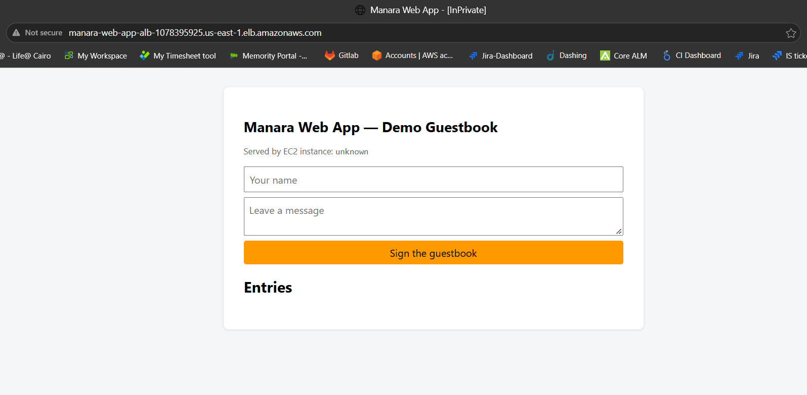
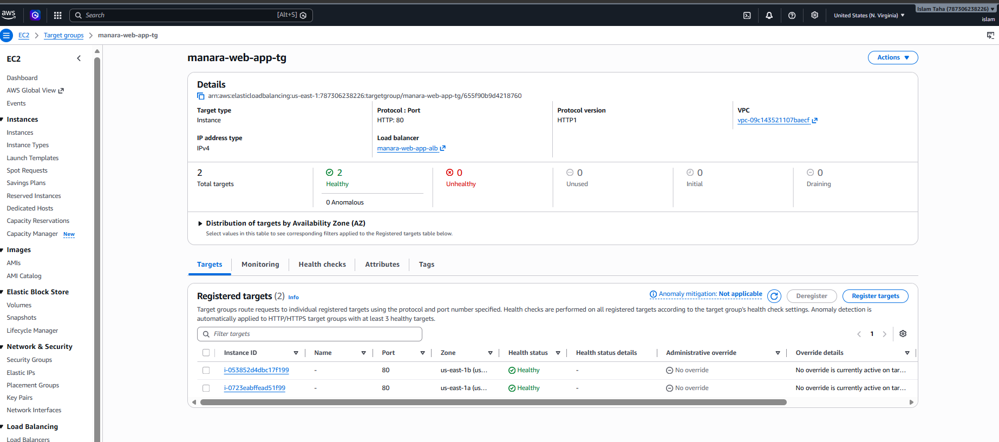
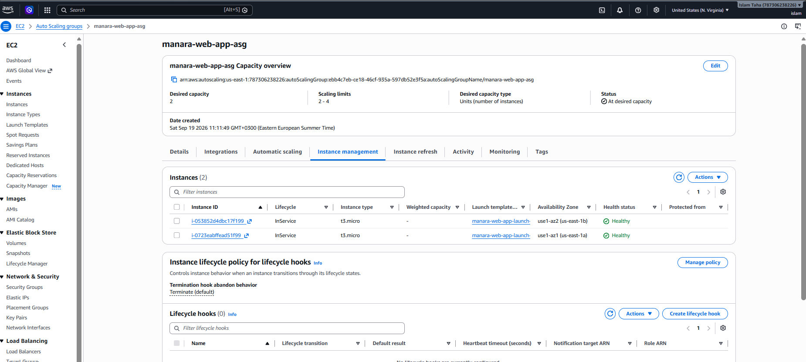
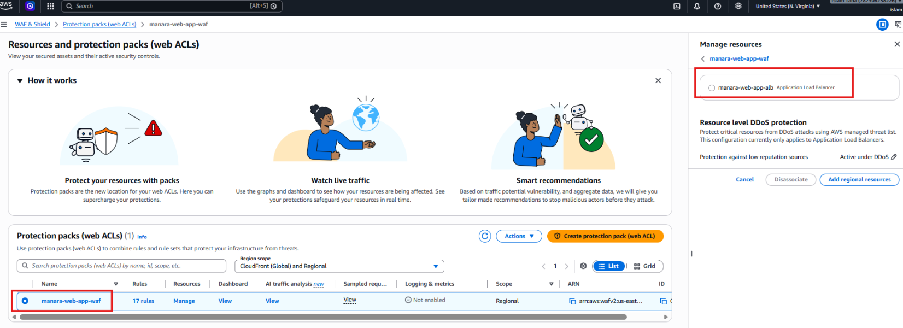
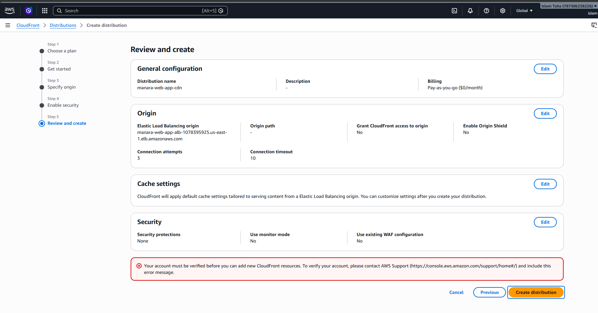

# Manara Web App — Scalable & Secure AWS Architecture

An end-to-end, highly available, and secure multi-tier PHP Guestbook application deployed on AWS infrastructure. This repository contains the application source code, infrastructure bootstrapping scripts, and deployment verification documentation.

---

## 🏛️ Architecture Overview

The system is designed with an edge content delivery layer leading into a two Availability Zone (`us-east-1a` and `us-east-1b`) custom Virtual Private Cloud (VPC):

* **Edge Tier:** Amazon CloudFront CDN configured for global edge caching, HTTP-to-HTTPS redirection, and dynamic method/header forwarding (`AllViewer` request policy).
* **Ingress & Security:** AWS WAF Regional Protection Pack (`manara-web-app-waf`) protecting the Application Load Balancer (ALB) with AWS Managed Core and SQL Injection rule sets.
* **Networking (VPC):** Custom VPC with 2 Public Subnets (housing ALB, IGW, and NAT Gateway) and 2 Private Subnets (housing EC2 instances and RDS) across `us-east-1a` and `us-east-1b`.
* **Compute & Auto Scaling:** Auto Scaling Group (ASG) maintaining EC2 instances running Apache 2.4 and PHP 8.x across private subnets.
* **Database Tier:** Amazon RDS for MySQL (`appdb`) hosted securely in private subnets with auto-table initialization (`guestbook`).
* **Egress Traffic:** NAT Gateway located in the public subnet enabling private EC2 instances to fetch OS updates (`dnf update`) and connect to AWS Systems Manager (SSM).
* **Security Groups:** Tier-by-tier least privilege isolation (ALB -> App -> RDS).

```text
[ Internet Traffic ]
        │
        ▼
[ Amazon CloudFront CDN ]
        │
        ▼
[ AWS WAF Protection Pack ]
        │
        ▼
[ Application Load Balancer ]
        │
        ├─────────────────────────────────────────┐
        ▼                                         ▼
[ Private Subnet 1a ]                     [ Private Subnet 1b ]
  • EC2 Auto Scaling (Apache/PHP)           • EC2 Auto Scaling (Apache/PHP)
        │                                         │
        └────────────────────┬────────────────────┘
                             │
                             ▼
                  [ Private DB Subnets ]
                   • Amazon RDS MySQL
---

## 📂 Repository Structure

    .
    ├── src/
    │   ├── db.php           # PDO connection handler & schema initialization
    │   ├── health.php       # Decoupled ALB health check endpoint (HTTP 200)
    │   ├── index.php        # Guestbook application logic & frontend UI
    │   └── style.css        # Application UI stylesheet
    ├── screenshots/         # Architecture proof & console verification snapshots
    │   ├── 01-web-app-ui.png
    │   ├── 02-target-group-healthy.png
    │   ├── 03-asg-instances.png
    │   ├── 04-waf-protection-pack.png
    │   └── 05-cloudfront-verification.png
    ├── user-data.sh         # EC2 bootstrap script used in Launch Template
    └── README.md            # Technical documentation

---

## 🌐 Edge Content Delivery (CloudFront CDN) & Boundary Analysis

### CloudFront Implementation Strategy
The architecture was designed to leverage Amazon CloudFront as an edge acceleration layer in front of the Application Load Balancer:
* **Protocol Enforcement:** Enforce HTTP-to-HTTPS redirection at the global edge.
* **Dynamic Routing:** Pass all HTTP methods (`GET, HEAD, OPTIONS, PUT, POST, PATCH, DELETE`) to support live guestbook submission logic.
* **Header & Cookie Forwarding:** Utilize custom Origin Request Policies (`AllViewer`) to forward headers directly to Apache web servers.

### Setup Boundary & Administrative Resolution
During the final creation step of the CloudFront distribution, deployment reached an AWS administrative boundary:

> **Constraint Encountered:** *"Your account must be verified before you can add new CloudFront resources. To verify your account, please contact AWS Support."*

* **Root Cause:** Standard security restriction applied by AWS on new or laboratory accounts to prevent misuse of global edge services prior to manual quota verification.
* **Resolution Strategy:** Full CloudFront distribution parameters (Origins, Cache Behaviors, and Security settings) were configured and documented. As a fallback, primary ingress security was enforced directly at the ALB tier using **AWS WAF (`manara-web-app-waf`)**, rendering the full multi-tier stack secure and operational.

---

## 🔒 Security Group Specifications

| Security Group | ID | Inbound Rules | Outbound Rules |
| :--- | :--- | :--- | :--- |
| **`alb-sg`** | `sg-0c13dcf70152a568d` | HTTP (80) from `0.0.0.0/0` | HTTP (80) to `ec2-app-sg` |
| **`ec2-app-sg`** | `sg-013b8b4bcd2341dea` | HTTP (80) from `alb-sg` | All Traffic (`0.0.0.0/0`) for SSM/OS updates & MySQL (3306) to `rds-sg` |
| **`rds-sg`** | `sg-07b01c93d83c3334e` | MySQL (3306) from `ec2-app-sg` | Default Restricted |

---

## 📸 Deployment Deliverables & Screenshots

### 1. Application UI & Database Verification
The Guestbook UI running live through the ALB URL with working database write/read persistence:


### 2. Target Group Health Verification
Target group (`manara-web-app-tg`) confirming active EC2 instances in private subnets passing health checks:


### 3. Auto Scaling Group Instances
Auto Scaling Group (`manara-web-app-asg`) managing instance lifecycle across multi-AZ private subnets:


### 4. AWS WAF Protection Pack
Regional WAF protection pack (`manara-web-app-waf`) attached to the Application Load Balancer:


### 5. Edge Distribution & CloudFront Verification Boundary
CloudFront CDN configuration verification screen documenting standard account verification boundary:


---

## 🧹 Resource Decommissioning Sequence

When deleting resources, destroy them in this order to avoid dependency errors:

1. **AWS WAF:** Disassociate and delete Protection Pack `manara-web-app-waf`.
2. **Auto Scaling & EC2:** Delete ASG `manara-web-app-asg` (removes EC2 instances) and delete the Launch Template.
3. **Load Balancer:** Delete ALB `manara-web-app-alb` and Target Group `manara-web-app-tg`.
4. **Database:** Delete RDS instance `manara-web-app-db` (uncheck final snapshot).
5. **NAT Gateway:** Delete NAT Gateway in the VPC console and release its Elastic IP.
6. **VPC:** Delete `manara-web-app-vpc` (removes subnets, route tables, internet gateway, and security groups).